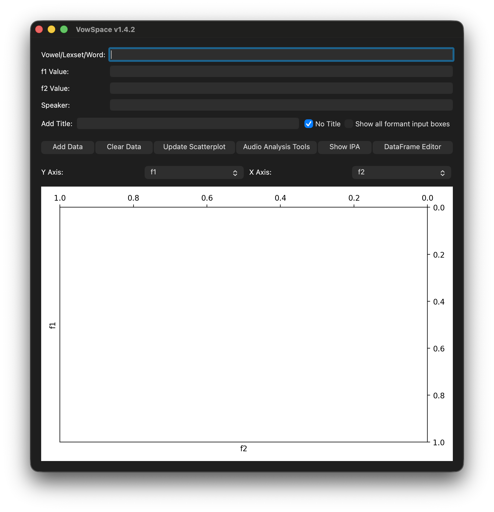
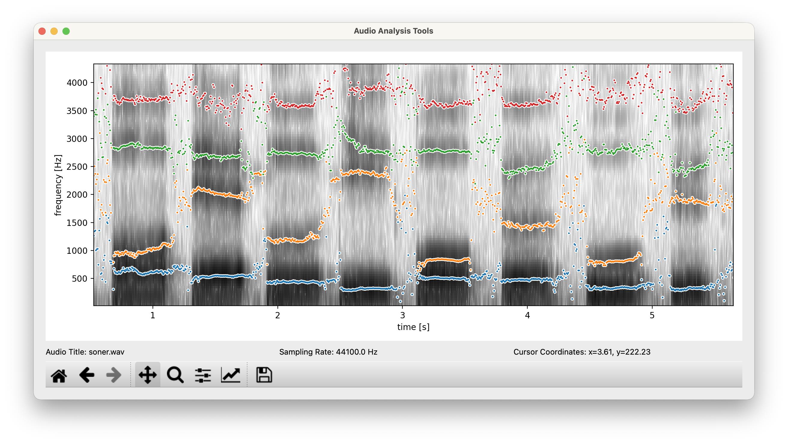

# Background

Vowel formant frequencies that vary by vowel and speaker, are essential in phonological and sociolinguistic analyses. These frequencies reveal language- and speaker-specific traits. F1 and F2 relate to vowel height and backness, aiding in vowel distinction [@PetersonBarney1952; @LadefogedJohnson2014]. F3 is generally associated with vowel openness and, along with F4 and F5, provides more delicate information about the speaker. Measuring and comparing formant frequencies is key in phonetics, dialectology, sociolinguistics, speech technology, and language learning.

However, formant values are influenced by a speaker’s vocal tract length, gender, and age, making direct comparisons between individuals difficult. To address this, researchers have developed various vowel normalization techniques to reduce physiological differences while maintaining phonemic contrasts [@Lobanov1971; @Adank2004; @Disner1980].

Visualization of these formant values, usually achieved through F1–F2 scatterplots, is a common method to analyze vowel inventories, show diachronic and regional differences, and assess speech perception experiments. However, such visualizations and normalizations are often made with scripting languages or software that have steep learning curves, which limits access for non-specialists or students.

# The VowSpace application

VowSpace is an open-source desktop application for acquiring, visualizing, normalizing, comparing, and analyzing vowel sounds from audio files and/or datasets. It offers an intuitive graphical user interface to explore vowel space across speakers and groups, supporting a variety of normalization methods such as the Bark Difference Metric, Lobanov, Nearey 1 and 2, as well as Bark, Log, Mel, and ERB transformations. It helps researchers visualize vowels, identify patterns, and compare formants.

The application overcomes manual plotting limits, allowing researchers to load formant data from datasets, normalize, and produce publication-ready analyses and visualizations. VowSpace is cross-platform and supports interactive, reproducible workflows.



VowSpace operates through a main interface supplemented by two modular tools: the Audio Analysis Tools and the DataFrame Editor. The Audio Analysis window allows users to load an audio file, view and extract segmental and suprasegmental features such as intensity, pitch, and vowel formant values (F1–F4) through a spectrogram plot. Users can then add formant values directly to the visualizer.



The DataFrame Editor enables quick, in-app editing of vowel data, with immediate updates to the scatterplot upon saving. Data can also be exported as a new spreadsheet. VowSpace supports the following minimal input format:

```
vowel f1 f2 speaker
/æ/ 123 1234 Markus
```

# Statement of Need

In phonetic and sociophonetic research, analyzing vowel formants is essential for understanding language variation, speaker physiology, and vowel space. Researchers often use general-purpose software like R or Praat, which require advanced skills and time for custom visualizations. VowSpace was created as an open-source tool for vowel space plotting, combining raw and normalized data. While R packages like `phonR` and `vowelPlot`, and Praat offer similar functions, they either assume programming expertise or lack accessible GUI features for normalization and visualization.

VowSpace fills this gap by offering:

- Simple data reading/writing capabilities by utilizing datasets,
- Graphical plotting of formant frequencies with speaker metadata,
- Built-in vowel normalization capabilities,
- Exportable figures suitable for publications,
- Audio analysis tools for the acquisition of vowel formants through spectrograms and formant lines.

This tool is ideal for researchers in phonetics, phonology, dialectology, and second-language acquisition, as well as instructors who demonstrate vowel space concepts in real-time.

# Research applications

VowSpace has been actively used in phonetic research projects involving Turkish vowel acoustics. It is the primary analysis tool in the TÜBİTAK 2209-A project "Vowel Space of Standard Turkish", which investigated the formant distributions of Turkish monophthongs across multiple speakers.

It is also being used in the ongoing collaborative study "Acoustic Analysis of Turkish Vowel Formants: A Methodological Perspective", conducted with Dr. Emre Yağlı. This project focuses on evaluating normalization techniques and methodological best practices for cross-speaker vowel comparison in Turkish.

These research have benefited from VowSpace’s integrated vowel plotting, normalization, and interactive data editing features.

# Acknowledgements

Development of this software was supported by mentorship and support from:

•	Dr. Emre Yağlı, Hacettepe University — for guidance on Turkish vowel formant research,

This project was developed independently with dedicated funding from the Scientific and Technological Research Council of Turkey (TÜBİTAK).

# References