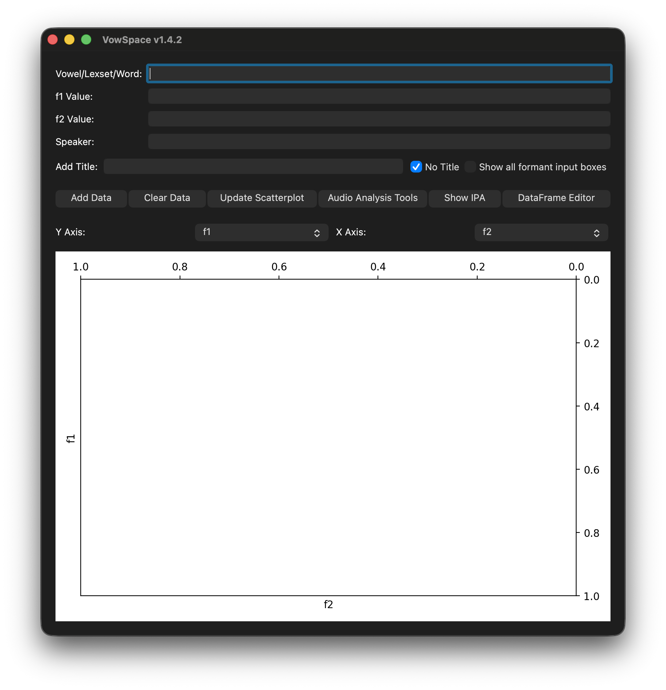
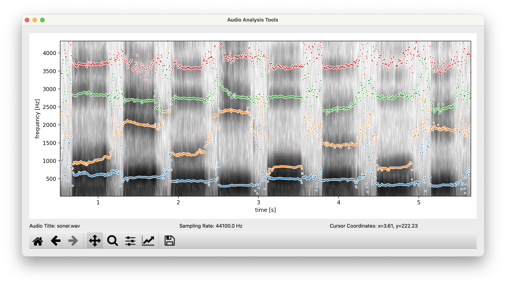

# Summary

Vowel formant frequencies, which vary by vowel and speaker, are crucial parameters in phonetic and sociolinguistic studies. These frequencies reveal language- and speaker-specific traits [@clopper2005], where F1 and F2 relate to vowel height and backness, while higher formants (i.e., F3, F4, and F5) provide detailed information regarding speaker identity [@fant1960; @stevens1999]. Measuring these frequencies is key across phonetics, sociolinguistics, dialectology, speech technology, and language learning.

However, formant values are inherently affected by a speaker’s vocal tract length, gender and age, making comparisons difficult. To address this, researchers have developed various vowel normalization techniques to reduce physiological differences while preserving phonetic contrasts [@adank2004; @disner1980; @lobanov1971]. Such normalization is essential for cross-speaker and cross-dialectal analysis, as it allows for the isolation of linguistic variation from biological variance.

VowSpace facilitates these analyses by providing an integrated environment that supports diverse input formats, including raw audio files (e.g., .wav, .flac, .mp3) for extraction and tabular datasets (e.g., CSV, Excel) for visualization. Visualization of formant values through F1-F2 scatterplots enables the study of vowel inventories, regional and diachronic differences, and speech perception experiments. To provide analytical depth, the application offers multiple visualization methods, including convex hulls and ellipses to delineate category boundaries and overlaps, as well as grouping by vowel or speaker to examine vowel inventories and enable cross-speaker comparisons on a vowel space. The application also offers a comprehensive normalization and conversion suite which includes the Bark Difference Metric [@traunmuller1990], Lobanov [@lobanov1971; @remirez2022], Nearey 1 and 2 [@nearey1978] normalizations, and Bark [@traunmuller1990], Log, Mel [@stevens1940], and Erb [@moore1983] conversions applicable by buttons, implemented as standardized functions to ensure reproducibility across different research settings and longitudinal datasets. While these processes often require complex scripting or specialized software, VowSpace provides an accessible graphical user interface (GUI) suitable for a wide range of use cases, from classroom instruction to phonetic fieldwork to specialized research in forensic phonetics and language acquisition.

# Statement of need

In phonetic and sociophonetic research, analyzing vowel formants is essential for understanding language variation, speaker physiology, and vowel space. Researchers often use general-purpose software, such as R [@r2021] or Praat [@boersma2025], which require advanced skills and time for custom normalizations and visualizations. This technical barrier can increase the workload because learning complex scripting tools may distract researchers, particularly students and non-specialists, from focusing on the main phonetic analysis. VowSpace is an open-source tool for vowel space plotting, combining raw and normalized data. While R packages like phonR [@mccloy2016] and vowels [@kendall2018], as well as Praat, offer similar functions, they either assume programming expertise or lack accessible GUI features for normalization and visualization.

VowSpace was developed to fill this gap by providing an offline desktop application for acquiring, handling, normalizing, and visualizing vowel formant data within a single environment. It was designed to minimize the level of technical expertise required to work with vowel formants, thereby making this area of research more accessible to newcomers. Considering the limited availability of dedicated applications for vowel formant analysis and the requirements of fields such as forensic phonetics, which necessitate offline platforms, VowSpace can serve as a primary tool for a wide range of phonetic analyses.

# State of the field

Besides R packages like phonR and vowels, and the widely used desktop application Praat, there are two web-based tools for vowel formant data normalization and visualization. NORM [@thomas2007] supports multiple normalization algorithms, including Lobanov, Nearey, Watt & Fabricius, and Bark difference, and allows for vowel space plotting and data export for cross-speaker and dialect comparisons. Visible Vowels [@heeringa2018] offers an interactive platform for uploading formant data, creating vowel plots, and conducting exploratory analyses such as clustering and multidimensional scaling, focusing on visual analytics for phonetic and sociolinguistic research.

VowSpace offers advantages over web-based tools like NORM and Visible Vowels, making it suitable for large-scale or advanced phonetic research. As a desktop application, it avoids browser and internet limitations, provides offline data security, and offers comprehensive normalization and visualization options. It integrates normalization methods, along with interactive plotting features like zoomable vowel charts, customizable colors, and high-quality exports. Additionally, VowSpace provides simple data reading and writing, graphical plotting with speaker metadata, exportable figures suitable for publication, and audio analysis tools for vowel formant acquisition through spectrograms and formant lines. These capabilities make VowSpace a flexible, precise, and user-friendly alternative for research and teaching across phonetics, phonology, sociolinguistics, and language teaching and acquisition.

# Software design

Developed in Python, VowSpace’s design heavily focuses on ease of use for students and professionals focusing on vowel formants in acquiring, visualizing, normalizing, comparing, and analyzing vowel formant frequencies from audio files and/or datasets. To this end, it features an intuitive GUI for exploring vowel space across speakers and groups with integrated normalization and visualization methods. By providing these tools in a unified environment, VowSpace enables researchers to load, normalize, and visualize formant data, providing publication-ready results across platforms that support interactive, reproducible workflows.

VowSpace has a modular architecture consisting of a main interface and two specialized tools: Audio Analysis and DataFrame Editor. The Audio Analysis window serves as a primary data extraction point, allowing users to load audio files in supported formats (i.e., .aiff, .aif, .aifc, .flac, .wav, .mp3, .ogg), visualize them as spectrograms, and extract acoustic features such as intensity, pitch, and vowel formants (F1–F4) using the Parselmouth library [@parselmouth2018]. Users can also add extracted formant values directly to the visualizer by clicking on the generated spectrogram, which minimizes manual transcription errors and facilitates immediate validation against existing distributions, thereby streamlining the transition from raw signal to analyzed data. These spectrogram images can be saved as JPEG, PNG, or TIFF files with visualized acoustic/prosodic information.

The built-in DataFrame Editor allows in-app data editing with instant scatterplot updates upon saving to ensure that visualization remains synchronized with the underlying dataset. Data can be exported as a spreadsheet. VowSpace uses a minimal input format to stay compatible with other tools and to fit easily into phonetic research workflows without requiring complex data structures. The supported minimal format is as follows:

```
vowel f1 f2 speaker
/æ/ 123 1234 Özlem
```

Supported columns include ‘bark_f1’ for Bark-transformed values, logarithmic values such as ‘log_f1’, and z-scores such as ‘zsc_f1’, all of which can be visualized. This integrated workflow ensures that data moves efficiently from extraction to publication-ready visualization. Tabular data can be imported from and exported to CSV (.csv) and Excel (.xlsx, .xls) formats to facilitate data sharing and long-term archival.

# Research impact statement

VowSpace was first developed in order to streamline the process of acquiring and plotting vowels, i.e., tasks traditionally requiring R scripts, without the need for multiple, disparate applications. Since then, it has evolved into a full-suite application that serves as a primary analysis tool in independent research. Initially focused on a visualization interface, its development has expanded to include standardized normalization methods, dedicated windows for spectrogram analysis, integrated data handling, and an IPA keyboard.

VowSpace was developed as the primary technical output and analytical framework for TÜBİTAK 2209-A project titled “Vowel Space of Standard Turkish.” The application was specifically designed to handle the data collection and processing requirements of this research, which focuses on formant distributions across speakers. Additionally, VowSpace serves as the central analysis tool for the ongoing methodological study, “Acoustic Analysis of Turkish Vowel Formants: A Methodological Perspective,” which focuses on normalization techniques for cross-speaker comparison in the Turkish language. By integrating these research requirements into a single environment, the tool has already demonstrated its utility in structured phonetic fieldwork and academic data management.

# Figures





# AI usage disclosure

Generative AI tools were used during the development of this application to assist with problem solving and code refactoring. All generated content was reviewed, tested, and validated by the author. No generative AI tools were used in the writing of this manuscript, or the preparation of supporting materials.

# Acknowledgements

VowSpace’s development has been supervised by Dr. Emre Yağlı from Hacettepe University. Further, the research was funded by the Scientific and Technological Research Council of Turkey under the project number 1919B012414090.

The human participant data (i.e., audio recordings) provided in the tutorial were collected in accordance with the ethical principles of the Declaration of Helsinki. The study received formal approval from the Hacettepe University Social Sciences and Humanities Ethics Board on 10 September 2024 (Ref: 2024/16). All participants provided written informed consent for their voice data to be recorded and used for research and instructional purposes.

# References
