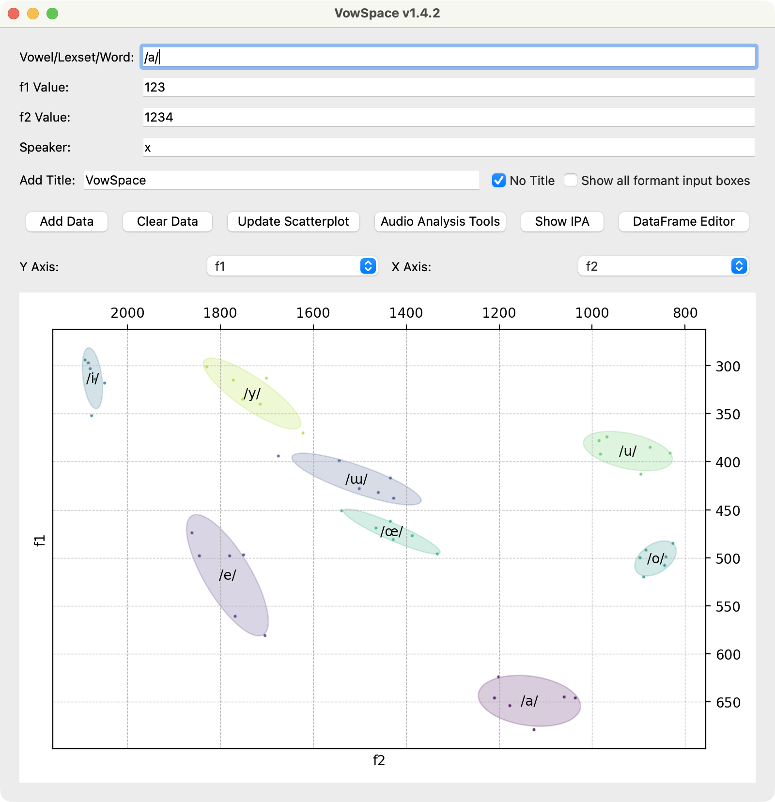

# Background

Vowel formant frequencies, which vary by vowel and speaker, are crucial in phonetic and sociolinguistic studies. These frequencies reveal language- and speaker-specific traits [@clopper2005]. F1 and F2 relate to vowel height and backness, aiding in vowel distinction, while F3, F4, and F5 provide more detailed speaker information [@fant1960; @stevens1998]. Measuring these frequencies is key across phonetics, sociolinguistics, dialectology, speech technology, and language learning.

Formant values are affected by a speaker’s vocal tract length, gender, and age, making comparisons difficult. To address this, researchers have developed various vowel normalization techniques to reduce physiological differences while preserving phonetic contrasts [@adank2004; @disner1980; @lobanov1971].

Visualization of formant values through F1-F2 scatterplots facilitates the analysis of vowel inventories, regional and diachronic differences, and speech perception experiments. However, these visualizations often require complex scripting or software, limiting access for non-specialists or students.

# The VowSpace application

VowSpace is an open-source desktop application for acquiring, visualizing, normalizing, comparing, and analyzing vowel formant frequencies from audio files and/or datasets. It features an intuitive graphical user interface for exploring vowel space across speakers and groups, with normalization methods including Bark Difference [@traunmuller1990], Lobanov [@lobanov1971], Nearey 1 and 2 [@nearey1978], Bark [@traunmuller1990], Log, Mel [@stevens1940], and Erb [@moore1983]. It helps researchers visualize vowels, identify patterns, and compare formants. 

VowSpace enables researchers to load, normalize, and visualize formant data, providing publication-ready results across platforms that support interactive, reproducible workflows.



VowSpace has a main interface and two tools: Audio Analysis and DataFrame Editor. The Audio Analysis window allows users to load audio files, view, and extract features such as intensity, pitch, and vowel formants (F1–F4) using a spectrogram using the Parselmouth library [@parselmouth2018]. Users can also add formant values to the visualizer. 


The built-in DataFrame Editor allows in-app data editing with instant scatterplot updates upon saving. Data can be exported as a spreadsheet. VowSpace supports a minimal input format:

```
vowel f1 f2 speaker
/æ/ 123 1234 Markus
```

Supported columns include ‘bark_f1’ for Bark, logarithmic ‘log_f1’, and z-scores ‘zsc_f1’, which can be plotted.

# Statement of Need

In phonetic and sociophonetic research, analyzing vowel formants is essential for understanding language variation, speaker physiology, and vowel space. Researchers often use general-purpose software, such as R or Praat, which require advanced skills and time for custom visualizations. VowSpace is an open-source tool for vowel space plotting, combining raw and normalized data. While R packages [@r2021] like phonR [@mccloy2016] and vowels [@kendall2018], as well as Praat [@boersma2025], offer similar functions, they either assume programming expertise or lack accessible GUI features for normalization and visualization.

Besides R packages like phonR and vowels, and the widely used desktop application Praat, there are two web-based tools for vowel formant data normalization and visualization. NORM supports multiple normalization algorithms, including Lobanov, Nearey, Watt & Fabricius, and Bark difference, and allows for vowel space plotting and data export for cross-speaker and dialect comparisons [@thomas2007]. Visible Vowels offers an interactive platform for uploading formant data, creating vowel plots, and conducting exploratory analyses such as clustering and multidimensional scaling, focusing on visual analytics for phonetic and sociolinguistic research [@heeringa2018].

VowSpace offers advantages over web-based tools like NORM and Visible Vowels, making it suitable for large-scale or advanced phonetic research. As a desktop application, it avoids browser and internet limitations, supporting larger datasets, offline data security, and comprehensive visualization. It integrates normalization methods such as Nearey 1 and 2 and the Bark Difference Metric, along with interactive plotting features like zoomable vowel charts, customizable colors, and high-quality exports. Additionally, VowSpace provides simple data reading and writing, graphical plotting with speaker metadata, exportable figures suitable for publication, and audio analysis tools for vowel formant acquisition through spectrograms and formant lines. These capabilities make VowSpace a flexible, precise, and user-friendly alternative for research and teaching across phonetics, phonology, sociolinguistics, and second-language acquisition.


# Research applications

VowSpace has been utilized in Turkish vowel acoustics research, including the TÜBİTAK 2209-A project Vowel Space of Standard Turkish, which studies formant distributions across speakers. It is also part of the ongoing study titled Acoustic Analysis of Turkish Vowel Formants: A Methodological Perspective, which focuses on normalization techniques and methods for cross-speaker comparison in Turkish. The tool’s features, like vowel plotting, normalization, and data editing, aid these studies.

# Acknowledgements

VowSpace’s development has been supervised by Dr. Emre Yağlı from Hacettepe University for research on Turkish vowel formants. Further, the research was funded by the Scientific and Technological Research Council of Turkey under the project number 1919B012414090.

# References