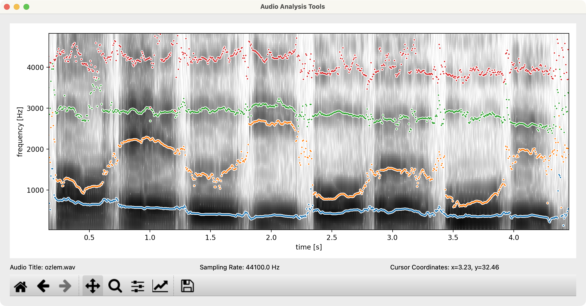

# Background

Vowel formant frequency varies by vowel and speaker, and plays a crucial role in phonological and sociolinguistic analysis. These frequencies reveal language- and speaker-specific traits. The first and second formants (F1 and F2) relate to vowel height and backness, providing a robust acoustic basis for distinguishing vowel categories [@peterson1952; @ladefoged2014]. Measuring and comparing formant frequencies is key in phonetics, dialectology, sociolinguistics, forensic linguistics, speech technology, and second language acquisition. 

However, raw formant values are influenced by anatomical factors such as vocal tract length, age, and gender, making direct comparison across speakers problematic. To address this, various normalization techniques have been developed to reduce inter-speaker variability while preserving meaningful linguistic contrasts [@lobanov1971; @adank2004; @disner1980].

Visualizing vowel formants—typically via F1-F2 scatterplots—is a widely used method for exploring vowel inventories, diachronic change, and sociophonetic variation. Yet, most visualization workflows depend on scripting tools or software with steep learning curves, limiting accessibility for non-programmers or students.

# The VowSpace application


**VowSpace** is an open-source desktop application for acquiring, visualizing, normalizing, comparing and analyzing vowel sounds from audio files and/or spreadsheets. It provides an intuitive graphical interface for exploring vowel spaces across speakers and groups, supporting a variety of normalization methods including the Bark Difference Metric, Lobanov, Nearey 1 and 2, as well as Bark, Log, Mel, and Erb transformations. (cite norm here)

## Vowel plotting in VowSpace

VowSpace uses the Matplotlib (3.8.2) (Hunter, 2007) library to draw a canvas and visualize the data. When plotting vowel formants, VowSpace utilizes a rectangular template with f1 value on the rightmost side and f2 value on the bottommost side of the screen with rulers on the opposite sides of the values. The vowels that belong to different sources are represented with points with different colors.

## Vowel normalization in VowSpace

VowSpace provides options for normalizing vowel formants under the “Data Settings” menu. In its current version, several normalization and frequency scale conversion methods have been implemented to facilitate cross-speaker comparison and perceptual modeling. All normalization methods are implemented in Python based on the work of Remirez (2022), and adapted using resources such as phonR (Drammock, 2022). 

## Audio Analysis Tools



Audio Analysis Tools is a separate window that the user can access through the VowSpace’s main user interface. Then the user can read an audio file and get segmental and suprasegmental information about it such as intensity, pitch and vowel formant frequencies (f1-f4). All of this is done with the help of the Parselmouth library, an intuitive interface of Praat for Python.

In the most current stage of development, the user is able to add the formant frequencies to the main visualizer window on any given t to the VowSpace interface by right-clicking on the plot on the audio analysis window.

## DataFrame Editor and data table format


DataFrame Editor is a separate window to make small adjustments on the data that you’re working on without relying on any other application. When you use the ‘Save Changes’ function, the scatterplot automatically updates with the latest data. The altered data can also be saved as a separate spreadsheet through the ‘Save Data As…’ action.

The minimum data table for any data to be read by VowSpace is as follows:

```
vowel f1 f2 speaker
/æ/ 123 1234 Markus
```

The only necessary rows are ‘vowel’, ‘f1’, ‘f2’, and ‘speaker’. When any data is inputted through the user interface, a dataframe is created with this information. Columns like ‘bark_f1’ for the Bark metric, logarithmic values like ‘log_f1’ and z-scores like ‘zsc_f1’ are also supported.


VowSpace also offers an IPA Keyboard that consists of the vowels in the International Phonetic Alphabet for ease of use for linguists and phoneticians.

# Statement of need

Existing tools such as `phonR`, `vowelPlot`, or Praat offer similar capabilities, but either require programming knowledge or lack streamlined GUIs for a more efficient workflow. VowSpace bridges this gap with a user-friendly interface suitable for researchers in phonetics, sociolinguistics, forensic linguistics, dialectology, and second language research, as well as for teaching applications.

VowSpace addresses the limitations of manual plotting and high-barrier scripting environments by offering:

- Simple data reading/writing capabilities by using spreadsheets,
- Graphical plotting of F1 vs. F2 with speaker metadata,
- Vowel normalization using various methods,
- Exportable figures suitable for publication, 
- Audio analysis tools for acquiring vowel formants through spectrograms, and formant lines.

# Acknowledgements

Development of this software was supported by mentorship from:

Dr. Emre Yağlı (Hacettepe University), for guidance on Turkish vowel formant research.

This project was developed independently with dedicated funding from the Scientific and Technological Research Council of Turkey (TÜBİTAK).

# References